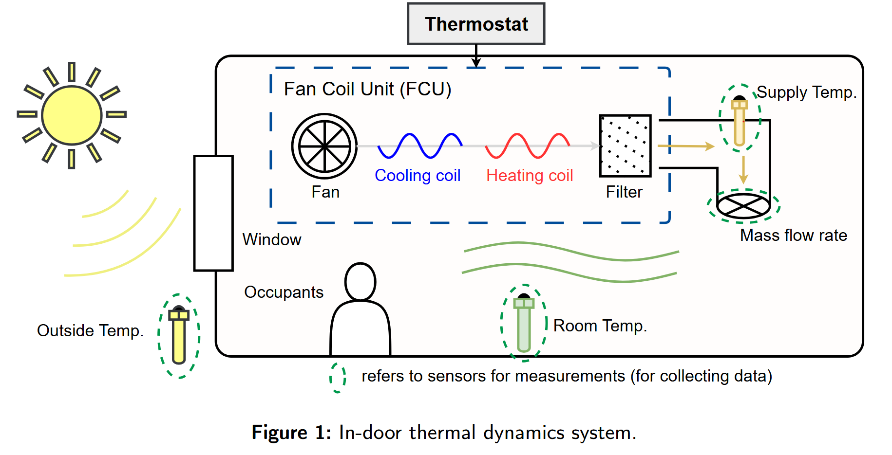
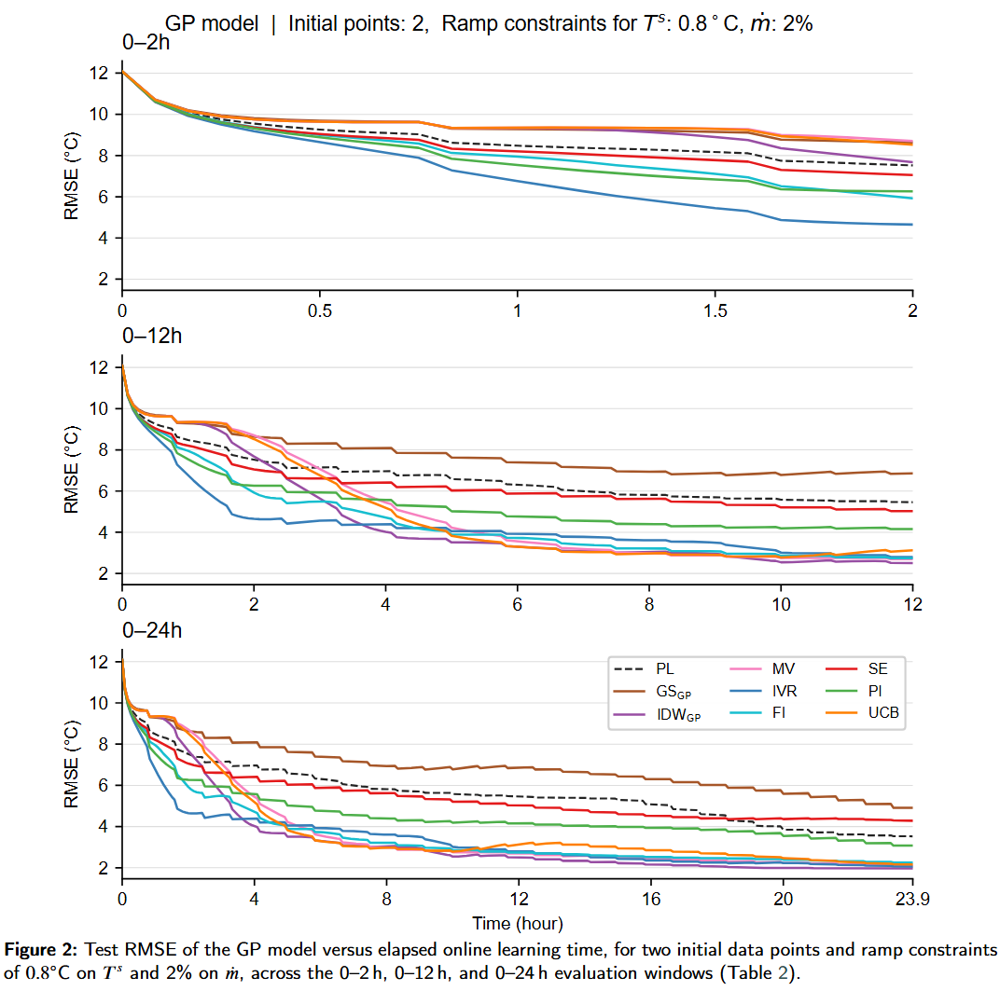

# Active Learning for Optimal Experimental Design in Machine Learning-Based Building Energy System Identification

[](https://arxiv.org/abs/2606.25301)
[](https://www.python.org/)
[](https://pytorch.org/)
[](https://gpytorch.ai/)
[](https://ibpsa.github.io/project1-boptest/)

<p align="center">
  
</p>

Code accompanying [*"Active Learning for Optimal Experimental Design in Machine
Learning-Based Building Energy System Identification"*](https://arxiv.org/abs/2606.25301). It implements and
benchmarks 14 active learning (AL) acquisition strategies — plus a passive
learning (PL) baseline with uniformly random control inputs — for learning
the room-temperature dynamics of the `bestest_air` HVAC test case in
[BOPTEST](https://ibpsa.github.io/project1-boptest/), using two model
classes: a feedforward neural network (NN) and a Gaussian process (GP).

## 📁 Repository layout

```
Code/
├── README.md
├── requirements.txt
├── HVAC.png
├── Tight_constraints.png
└── best_air/
    ├── GP/                        # Gaussian process experiments
│   ├── best_air_PL_GP.ipynb      # Passive learning baseline
│   ├── best_air_AL_GS_GP.ipynb   # Greedy Sampling
│   ├── best_air_AL_IDW_GP.ipynb  # Inverse Distance Weighting
│   ├── best_air_AL_MV_GP.ipynb   # Maximize Variance
│   ├── best_air_AL_IVR_GP.ipynb  # Integrated Variance Reduction
│   ├── best_air_AL_FI_GP.ipynb   # Fisher Information
│   ├── best_air_AL_SE_GP.ipynb   # Shannon Entropy
│   ├── best_air_AL_UCB_GP.ipynb  # Upper Confidence Bound
│   ├── best_air_AL_PI_GP.ipynb   # Probability of Improvement
│   ├── best_air_GP_MPC.ipynb     # MPC experiment using the learned GP
│   ├── call_GP.py                # ExactGPModel, train/eval helpers (GPyTorch)
│   ├── constant.py               # Per-run configuration (see below)
│   ├── processed_uniform_low_step_5m_data.csv  # Initial-pool + held-out test data
│   ├── checkpoints/               # Saved model weights (*.pth)
│   └── results/                   # Saved RMSE curves (*.csv) + plot/table scripts
├── NN/                            # Neural network experiments
│   ├── best_air_PL_NN.ipynb       # Passive learning baseline
│   ├── best_air_AL_GS_NN.ipynb    # Greedy Sampling
│   ├── best_air_AL_IDW_NN.ipynb   # Inverse Distance Weighting
│   ├── best_air_AL_QBC_NN.ipynb   # Query-by-Committee
│   ├── best_air_AL_MCD_NN.ipynb   # Monte Carlo Dropout
│   ├── best_air_AL_EMCM_NN.ipynb  # Expected Model Change Maximization
│   ├── best_air_AL_MLLC_NN.ipynb  # Maximize Last-Layer Change
│   ├── constant.py                # Per-run configuration (see below)
│   ├── processed_uniform_low_step_5m_data.csv
│   ├── checkpoints/
│   └── results/
└── README.md
```

Each notebook implements exactly one acquisition function from the table
below and otherwise follows the same online-learning loop: train/load an
initial model, repeatedly query BOPTEST for the next control input, advance
the simulation, append the observation, periodically retrain, and log the
test RMSE.

| Category         | Gaussian Process | Neural Network |
|------------------|-----------|-----------|
| Data space       | Greedy Sampling ($GS_{GP}$), Inverse Distance Weighting ($IDW_{GP}$) | Greedy Sampling ($GS_{NN}$), Inverse Distance Weighting ($IDW_{NN}$) |
| Uncertainty      | Maximize Variance (MV), Integrated Variance Reduction (IVR) | Query-by-Committee (QBC), Monte Carlo Dropout (MCD) |
| Information gain | Fisher Information (FI), Shannon Entropy (SE) | — |
| Model change     | Upper Confidence Bound (UCB), Probability of Improvement (PI) | Expected Model Change Maximization (EMCM), Maximize Last-Layer Change (MLLC) |

## ⚙️ Prerequisites

- 🐳 [Docker](https://docs.docker.com/get-docker/) (to run BOPTEST locally)
- 🐍 Python 3.12 with Jupyter/`ipykernel`
- 🖥️ Code for GPU and CPU are available

## 🚀 Setup

### 1. Start BOPTEST

You can either use the public BOPTEST web service, or run it locally with
Docker (recommended for repeated experiments, to avoid rate limits and
network latency). For a local deployment, following the
[BOPTEST docs](https://ibpsa.github.io/project1-boptest/):

```bash
# from the root of a BOPTEST checkout (e.g. software/project1-boptest-0.8.0)
docker compose up web worker provision --scale worker=N
```

where `N` is the number of test cases you want to run concurrently (e.g. set
`N` to however many notebooks you plan to run in parallel). This serves the
BOPTEST REST API at `http://127.0.0.1:80`, which is the `url` every notebook
talks to. Shut it down with `docker compose down` when finished.

### 2. Install Python dependencies

```bash
pip install -r ../requirements.txt
```

The `requirements.txt` only lists the packages actually imported by the code
in this folder (`requests`, `numpy`, `pandas`, `matplotlib`, `scipy`,
`scikit-learn`, `torch`, `gpytorch`, `casadi`, `ipykernel`). `torch` is pinned
to a CUDA 12.6 build. If you don't have a matching CUDA 12.6 GPU, install a
CPU-only or different CUDA build instead, e.g.:

```bash
pip install torch==2.7.1 --index-url https://download.pytorch.org/whl/cpu
```

### 3. Configure the run

Each of `GP/constant.py` and `NN/constant.py` controls one experimental
configuration:

- `Ne_tr` — size of the initial (warm-start) training set
- `ramp` — per-step ramp constraint on the normalized control inputs
- `step` — simulation step size in minutes (default 5)
- `num_count` — AL/PL budget in steps (default 288 = 1 day at 5-min steps)
- `number_of_data` — batch size between retraining events (default 10)
- NN only: `hidden_dim`, `epoch_ini`, `epoch_onl`, `lr`, `N_bootstrap`, `dropout_p`

Edit these before running a notebook to reproduce a specific row of the
paper's results tables (e.g. `Ne_tr=2, ramp=0.02` for the tightest-constraint
scenario, `Ne_tr=10, ramp=0.2` for the loosest).

### 4. Run a notebook

1. Open the notebook for the acquisition function you want to evaluate.
2. **Restart the kernel and clear all outputs** (a fresh BOPTEST `testid` is
   selected at the top of each notebook — old outputs/state should not be reused).
3. **Run All**. The notebook will select the `bestest_air` test case, step
   through the `typical_heat_day` scenario, and print progress per step.

### 5. Collect outputs

- `checkpoints/*.pth` — saved model weights (GP: `gpytorch` state dicts;
  NN: `torch.nn.Module` state dicts, including per-bootstrap committee
  members for QBC/EMCM/MLLC).
- `results/RMSE_<ACRONYM>_<GP|NN>_ini<Ne_tr>_<...>.csv` — the test RMSE
  logged at every step of the online-learning loop.

### 6. Regenerate tables and figures

```bash
cd GP/results   # or NN/results
python table_results.py   # prints a LaTeX table (windowed mean/last RMSE)
python plot_results.py    # saves a learning-curve PDF
```

Both scripts read the `CONFIG` (or `N_INIT`/`RAMP`/`LR`) constants at the top
of the file to pick which `RMSE_*.csv` files to load — update them to match
the configuration you ran in step 3.

> **Note:** `GP/results/table_results.py` and `plot_results.py` currently key
> their `AL_STRATEGIES` list off the *old* acronyms `US`/`FS`/`IG`, which no
> longer match the filenames the notebooks save (`MV`/`FI`/`SE`). Update those
> three keys (or rename the CSVs) before running the GP table/plot scripts.

## 📊 Results

Example learning curves for the tightest-constraint scenario (2 initial
points, ramp constraint of 0.8°C on $T^s$ / 2% on $\dot{m}$), comparing all
acquisition functions against the passive-learning baseline:

<p align="center">
  
</p>

## 📜 Citation

If you use this code, please cite:

```
@misc{nguyen2026activelearningoptimalexperimental,
      title={Active Learning for Optimal Experimental Design in Machine Learning-Based Building Energy System Identification}, 
      author={Nam T. Nguyen and Truong X. Nghiem},
      year={2026},
      eprint={2606.25301},
      archivePrefix={arXiv},
      primaryClass={eess.SY},
      url={https://arxiv.org/abs/2606.25301}, 
}
```

## ✉️ Corresponding author
📧 Email: nam.nguyen2@ucf.edu

🌐 Website: https://namnguyenee2.github.io/
